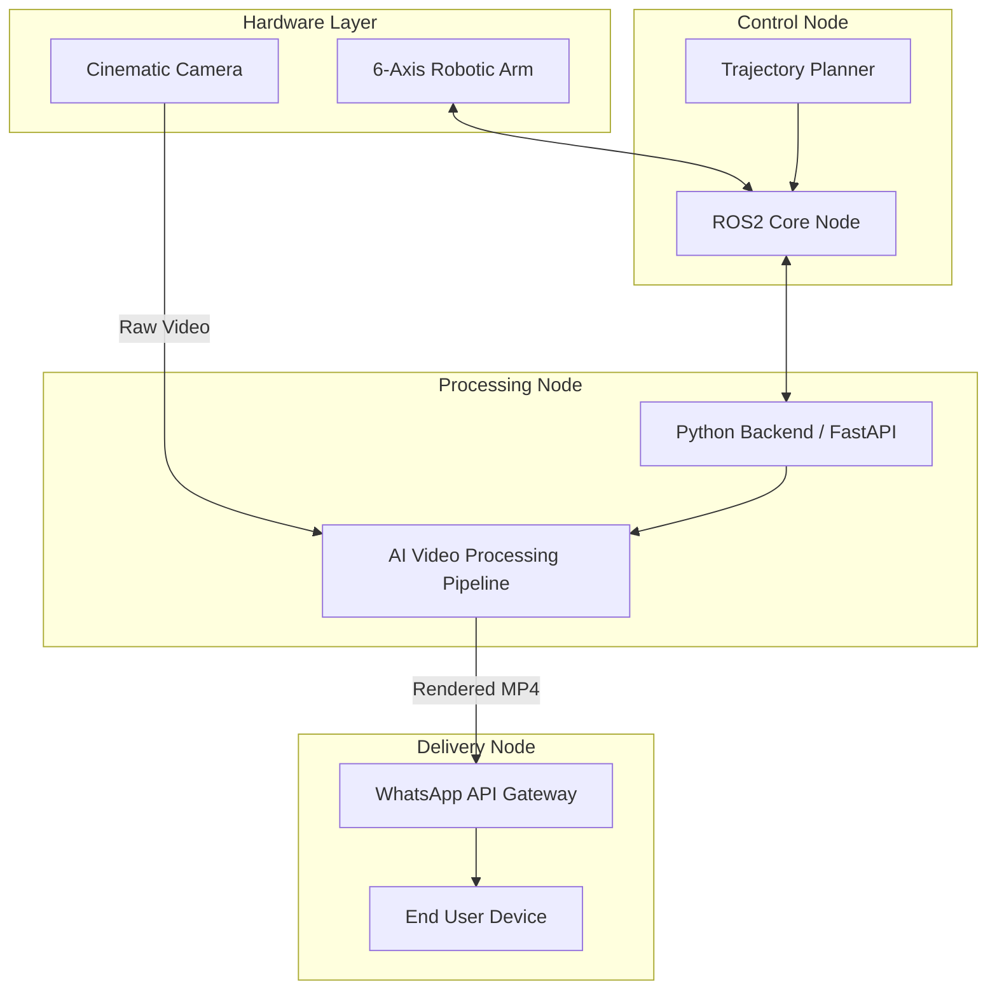

# 🤖 Robobooth

> **A fully automated, AI-powered cinematic video capture system utilizing 6-axis robotics.**

*Note: The source code for this project is closed-source and confidential. This repository serves as an architectural showcase and engineering case study.*

---

## 📋 Overview

**Robobooth** is an end-to-end automated system designed to capture high-quality, cinematic branded videos using a 6-axis industrial robotic arm. The system seamlessly handles everything from the physical camera trajectory planning to instant post-processing and direct delivery to users via WhatsApp. 

By integrating advanced robotics with real-time AI processing and automated messaging pipelines, Robobooth provides a frictionless, futuristic user experience for event activations and branded marketing.

## 🛠️ Tech Stack

This project bridges the gap between hardware control and software automation:

- **Robotics & Kinematics:** `ROS2` (Robot Operating System), C++
- **Backend & Communication:** `Python`, `FastAPI`
- **Video Processing:** `OpenCV`, `FFmpeg`, AI-based processing models
- **Delivery Pipeline:** WhatsApp Business API, Cloud Webhooks
- **Hardware:** 6-Axis Industrial Robotic Arm, High-Frame-Rate Cinematic Camera

## ⚙️ System Architecture

The architecture is decoupled into three primary nodes: Physical Control, Processing, and Delivery.

## 🚀 Core Features

1. **Automated Trajectory Planning:** Uses ROS2 to execute precise, repeatable, and cinematic camera movements around subjects without human intervention.
2. **Instant AI Post-Processing:** Automatically ingests raw camera footage, applies AI-driven enhancements (color grading, background manipulation, branding overlays), and renders the final video in near real-time.
3. **Frictionless Delivery:** Communicates securely with the WhatsApp API to deliver the final branded video directly to the user's phone within seconds of capture.
4. **Reliable IPC (Inter-Process Communication):** Custom Python bridge ensuring asynchronous, fault-tolerant communication between the ROS2 hardware nodes and the high-level software backend.

## 🧠 Engineering Challenges Solved

- **Hardware/Software Synchronization:** Achieving microsecond-level synchronization between the physical robotic movement and the start/stop triggers of the external cinematic camera.
- **Real-Time Video Rendering:** Optimizing the AI and OpenCV processing pipelines to ensure video processing finishes almost immediately after the robot completes its path, preventing user queuing delays.
- **Robustness in the Wild:** Developing fault-tolerant Python communication scripts to handle potential API timeouts or hardware disconnects gracefully, ensuring the robotic arm safely returns to home position.
